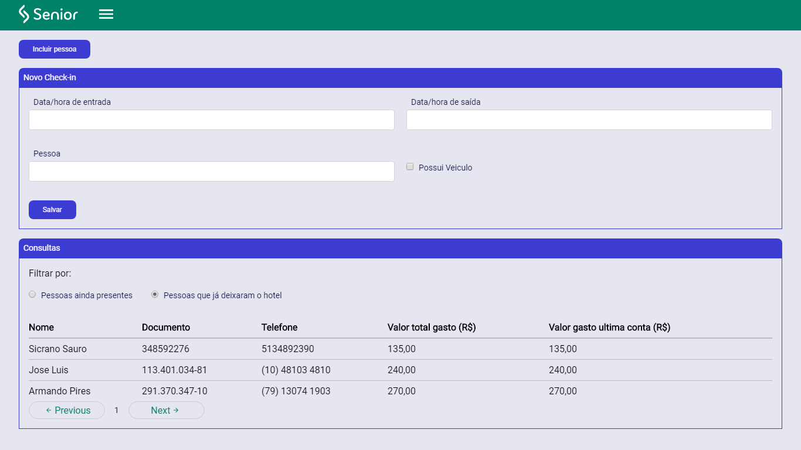

<div align="center">

[](https://www.senior.com.br/)

# **Hotel Senior**

</div>

🏨 **Frontend para Aplicação de Controle de hóspedes em hotel.**

<div align="center">



</div>


### ⚛ Desenvolvida usando [React JS](https://pt-br.reactjs.org/);

# 🔐 **Desafio:**

Desenvolver uma solução Frontend que possibilite realizar o cadastro de hóspedes e o check-in.

## 👓 **Requisitos funcionais:**

- [x] Um CRUDL para o cadastro de hóspedes;

- [x] No check in deve ser possível buscar hóspedes cadastrados pelo nome, documento ou telefone;

- [x] Consultar hóspedes que já realizaram o check in e não estão mais no hotel;

- [x] Consultar hóspedes que ainda estão no hotel;

- [x] As consultas devem apresentar o valor (valor total e o valor da última hospedagem) já gasto pelo hóspede no hotel;

### 📏 **Regras de negócio:**

- Uma diária no hotel de segunda à sexta custa R\$120,00;
- Uma diária no hotel em finais de semana custa R\$150,00;
- Caso a pessoa precise de uma vaga na garagem do hotel há um acréscimo diário, sendo R$15,00 de segunda à sexta e R$20,00 nos finais de semana;
- Caso o horário da saída seja após às 16:30h deve ser cobrada uma diária extra;

**Conforme acordado com o Rafael Liberato:**

- > Se o hóspede entrar em uma sexta-feira e sair em um sábado, será cobrada apenas uma diária (no valor da diária de sábado = R\$ 150,00);

- > Se o hóspede entrar e sair no mesmo dia, será cobrada uma diária inteira;

# 🔨 Instalação

1. O primeiro passo é clonar o repositório. As instruções estão [aqui](https://github.com/froiskallico/hotelSenior/blob/master/README.md#-instala%C3%A7%C3%A3o);

2. Vá para o diretório do Frontend:
   ```bash
   $ cd .../hotelSenior/frontend
   ```

3. Use o [Yarn](https://yarnpkg.com/) para instalar as dependências:
   ```bash
   $ yarn
   ```

4. Execute o seguinte comando no terminal para iniciar a aplicação.
   ```bash
   $ yarn start
   ```

    Este comando irá executar o servidor em modo de desenvolvimento. Para acessar a aplicação digite no seu navegador `http://localhost:3000/`. <br /> O servidor irá recarregar automaticamente a aplicação quando os arquivos forem alterados.


Se quiser preparar a aplicação para produção, digite o comando abaixo
   ```bash
   $ yarn build
   ```

Este comando irá preparar os arquivos, na pasta `build`, otimizados para melhor performance para ambiente de produção.

Para mais informações sobre deploy, [acesse a documentação oficial](https://facebook.github.io/create-react-app/docs/deployment).
